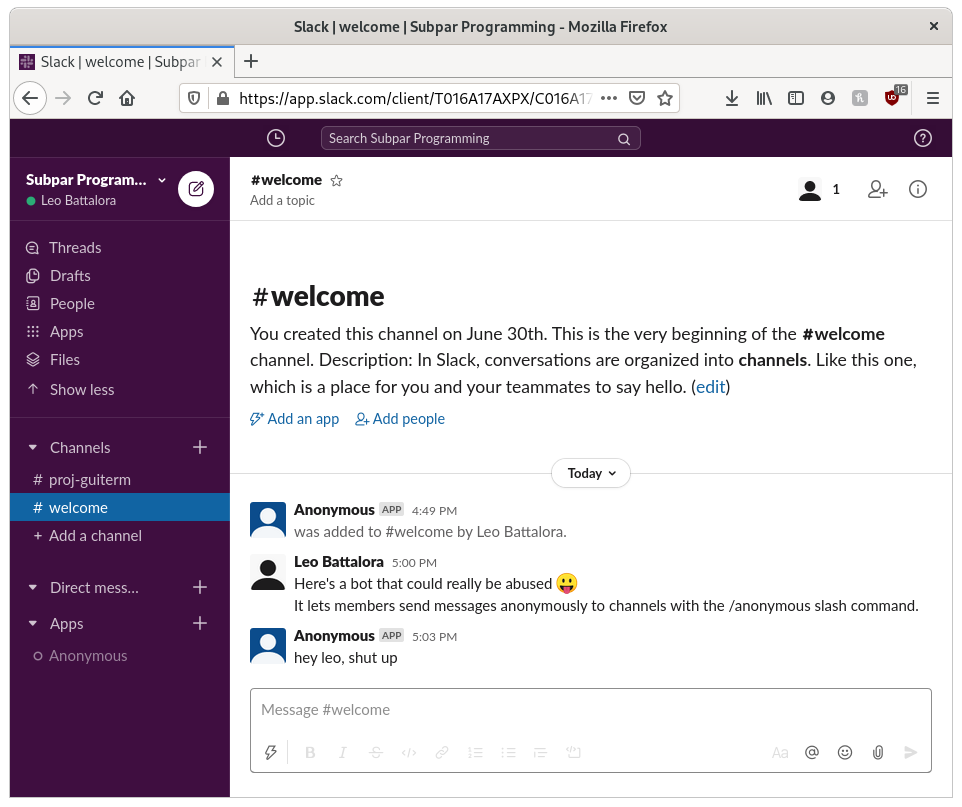
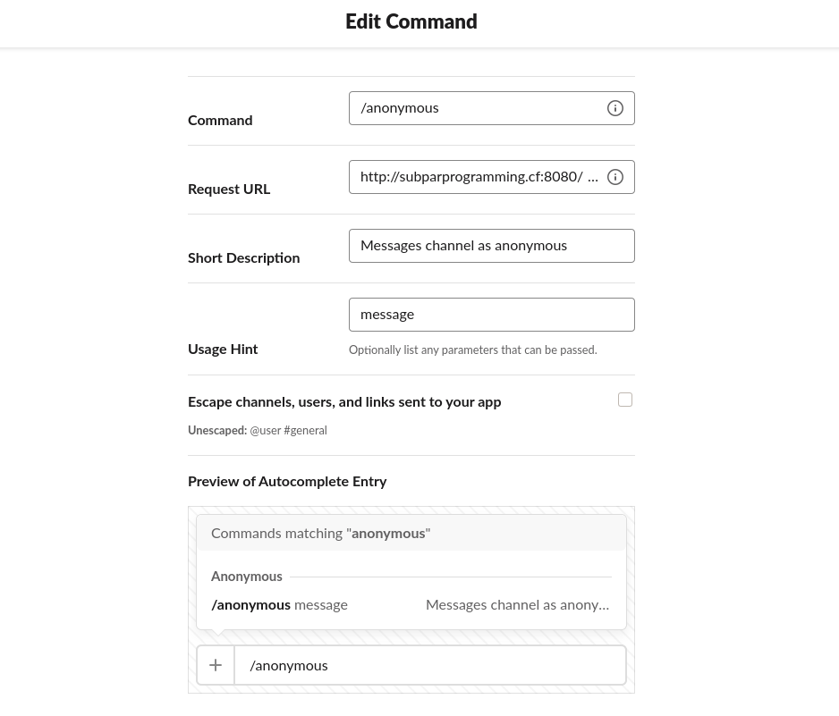

# Slack Anonymous Bot (Slash Command)
slash command to post as Anonymous in a channel

_tested on: node v10.21.0, npm v6.14.4, express v4.17.1, qs v6.9.4, xmlhttprequest v1.8.0_

### Instructions:
  1) place anonymous.js in an empty directory
  2) cd into the new directory
  3) modify the values of slackToken and slackSigningSecret in anonymous.js
  4) $ npm install express xmlhttprequest qs
  5) create an app with a slash command with the Request URL:
     http://server.url:port/anonymous
  6) make sure app has Bot Token Scopes: chat:write, commands
  7) add the app to workspace
  8) $ node anonymous.js
  

